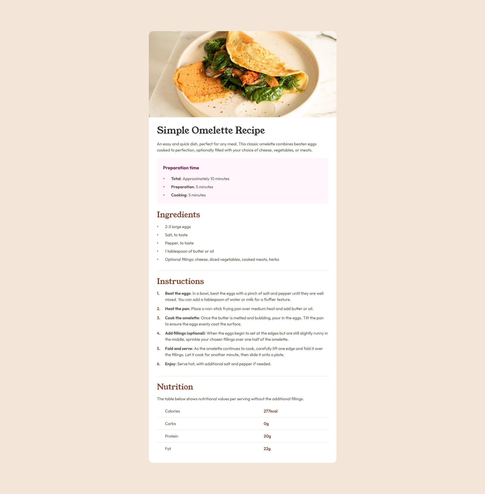

# Frontend Mentor - Recipe page solution

This is a solution to the [Recipe page challenge on Frontend Mentor](https://www.frontendmentor.io/challenges/recipe-page-KiTsR8QQKm). Frontend Mentor challenges help you improve your coding skills by building realistic projects. 

## Overview

### Screenshot

### Links

- Solution URL: [Github](https://github.com/laravue-18/frontend-mentor-recipe-page)
- Live Site URL: [Vercel](https://frontend-mentor-recipe-page-mauve.vercel.app/)

## My process

### Built with

- Semantic HTML5 markup
- Tailwind CSS
- Mobile-first workflow

### What I learned

- Customize List Styling
- Using TailwindCSS
